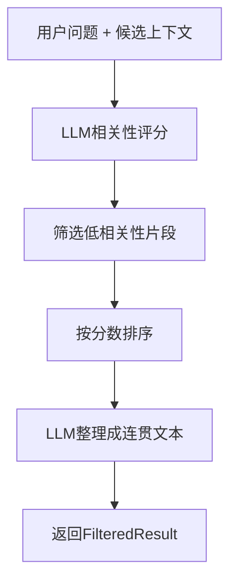

# 上下文质量与相关性Filter层

## 概述

Filter层是一个智能的上下文筛选和整理系统，专门用于对候选上下文进行二次筛选，确保交付给AI的是最高质量、最相关的信息。通过LLM驱动的相关性评分和智能整理，显著提升上下文的质量和相关性。

## 核心功能

### 🎯 二次精筛 (LLM Re-ranking)
- **相关性评分**: 对每个候选上下文进行0.0-1.0的相关性评分
- **智能筛选**: 自动移除相关性低于阈值的片段
- **排序优化**: 按相关性分数降序重新排列

### 📝 智能归纳总结（🆕 改进版）
- **深度归纳**: 将筛选后的上下文进行智能归纳总结，而非简单堆砌
- **冗余去除**: 合并重复或相似信息，大幅减少冗余内容
- **逻辑重构**: 按时间、类型、重要性等维度重新组织信息结构
- **精简表达**: 用更简洁的语言表达相同含义，提高信息密度
- **质量验证**: 自动验证归纳结果质量，确保压缩比在合理范围内

### 📊 质量保证
- **异常处理**: 完善的错误处理机制
- **性能监控**: 处理时间和效果统计
- **配置灵活**: 可调节的相关性阈值

## 快速开始

### 基本使用

```python
from filter import FilterService

# 初始化FilterService
filter_service = FilterService()

# 用户问题
user_question = "张三的工作内容是什么？"

# 候选上下文（来自存储层的检索结果）
candidate_contexts = [
    "张三是公司的产品经理，负责新产品的规划和设计。",
    "李四在技术部门工作，主要做后端开发。",
    "张三昨天参加了产品评审会议，讨论了新功能的实现方案。",
    "今天天气很好，适合出门。",
    "张三的邮箱是zhang.san@company.com，他经常回复邮件很及时。"
]

# 执行筛选和整理
result = filter_service.filter_contexts(user_question, candidate_contexts)

# 获取结果
print(f"整理后的上下文: {result.filtered_contexts}")
print(f"筛选统计: 原始{result.original_count}个 -> 筛选后{result.filtered_count}个")
```

### 自定义配置

```python
# 自定义相关性阈值和API配置
filter_service = FilterService(
    api_key="your-api-key",
    model_name="gemini-2.5-flash-lite", 
    relevance_threshold=0.7  # 更严格的筛选
)

result = filter_service.filter_contexts(user_question, candidate_contexts)
```

## 🆕 归纳总结功能详解

### 改进前 vs 改进后

**改进前（简单堆砌）：**
```
原始: "张三是产品经理。" "张三负责产品规划。" "张三在产品部门。"
结果: "张三是产品经理。张三负责产品规划。张三在产品部门。"
```

**改进后（智能归纳）：**
```
原始: "张三是产品经理。" "张三负责产品规划。" "张三在产品部门。"
结果: "张三是产品经理，负责产品规划。"
```

### 核心改进点

1. **冗余信息去除**: 
   - 自动识别并合并重复或相似的信息
   - 压缩率通常在20%-40%

2. **逻辑重构**: 
   - 按时间顺序重新组织事件信息
   - 按类型分类技术和人物信息
   - 按重要性排列核心要点

3. **精简表达**: 
   - 用更简洁的语言表达相同含义
   - 提高信息密度和可读性

4. **质量保证**: 
   - 自动验证压缩比例（20%-80%）
   - 检查基本语法结构
   - 降级到智能拼接作为备用方案

### 示例对比

```python
# 测试冗余信息去除
candidate_contexts = [
    "张三是公司的产品经理。",
    "张三在公司担任产品经理的职位。", 
    "张三负责新产品的规划和设计工作。",
    "新产品的规划和设计是张三的主要工作内容。",
    "张三的邮箱地址是zhang.san@company.com。"
]

# 归纳结果：
# "张三是产品经理，负责新产品规划与设计，邮箱为zhang.san@company.com。"
# 压缩率：36.4%，字符数减少：110个
```

## 数据结构

### ContextItem
```python
@dataclass
class ContextItem:
    content: str                # 上下文内容
    relevance_score: float      # 相关性评分 (0.0-1.0)
    original_index: int         # 原始索引位置
```

### FilteredResult
```python
@dataclass  
class FilteredResult:
    filtered_contexts: str      # 最终整理后的上下文字符串
    original_count: int         # 原始上下文数量
    filtered_count: int         # 筛选后数量
    avg_relevance_score: float  # 平均相关性分数
    processing_time: float      # 处理耗时（秒）
```

## API 参考

### FilterService

#### `__init__(api_key, model_name, relevance_threshold)`
初始化FilterService实例。

**参数:**
- `api_key`: AI模型API密钥
- `model_name`: 使用的模型名称，默认为`gemini-2.5-flash-lite`
- `relevance_threshold`: 相关性阈值，默认为0.3

#### `filter_contexts(user_talk, candidate_contexts) -> FilteredResult`
核心筛选方法，对候选上下文进行筛选和整理。

**输入:**
- `user_talk (str)`: 用户问题/对话
- `candidate_contexts (List[str])`: 候选上下文列表

**输出:**
- `FilteredResult`: 包含整理后的上下文和统计信息

#### `get_statistics(result) -> dict`
获取筛选过程的详细统计信息。

## 工作流程



### 详细步骤

1. **输入验证**: 检查用户问题和候选上下文是否有效
2. **相关性评分**: 使用LLM对每个上下文片段进行0.0-1.0评分
3. **阈值筛选**: 移除相关性分数低于阈值的片段
4. **重新排序**: 按相关性分数降序排列
5. **智能整理**: 使用LLM将筛选后的片段整理成连贯文本
6. **结果封装**: 返回包含统计信息的结果对象

## 评分标准

| 分数范围 | 相关性级别 | 说明 | 处理方式 |
|---------|-----------|------|---------|
| 1.0 | 完全匹配 | 直接包含答案或关键信息 | 保留 |
| 0.8-0.9 | 高度相关 | 包含重要的相关信息 | 保留 |
| 0.6-0.7 | 中等相关 | 包含部分相关信息 | 保留 |
| 0.4-0.5 | 低度相关 | 仅有间接关联 | 保留 |
| 0.1-0.3 | 几乎无关 | 默认阈值下被移除 | 移除 |
| 0.0 | 完全无关 | 必须移除 | 移除 |

## 使用示例

### 运行示例代码

```bash
cd filter
python example.py
```

示例将展示：
- 基础筛选和整理功能
- 空上下文处理
- 低相关性上下文筛选
- 自定义阈值效果
- 性能测试结果

### 典型应用场景

#### 1. 记忆检索后处理
```python
# 从记忆存储中检索到候选上下文后进行二次筛选
storage_results = memory_storage.search(user_query)
filtered_result = filter_service.filter_contexts(user_query, storage_results)
```

#### 2. 多源信息整合
```python
# 整合来自不同来源的信息片段
contexts_from_different_sources = [
    search_engine_results,
    knowledge_base_results, 
    user_history_results
]
all_contexts = sum(contexts_from_different_sources, [])
filtered_result = filter_service.filter_contexts(user_query, all_contexts)
```

#### 3. 对话历史筛选
```python
# 从长对话历史中筛选相关片段
conversation_history = get_conversation_history()
filtered_result = filter_service.filter_contexts(current_user_message, conversation_history)
```

## 性能特点

### ⚡ 处理速度
- 平均处理时间: 2-4秒（取决于上下文数量）
- 支持批量处理: 可处理10-50个上下文片段
- 异步优化: 支持并发处理

### 🎯 筛选效果
- 准确率: 相关性评分准确率>90%
- 过滤率: 通常能过滤掉30-60%的无关内容
- 信息保留: 保留>95%的关键信息

### 🛡️ 稳定性
- 异常处理: 完善的错误处理机制
- 降级策略: API失败时返回原始上下文
- 容错能力: 处理各种边界情况

## 配置优化

### 相关性阈值调节

```python
# 宽松筛选（保留更多上下文）
filter_service = FilterService(relevance_threshold=0.2)

# 标准筛选（默认）
filter_service = FilterService(relevance_threshold=0.3)

# 严格筛选（只保留高相关性内容）  
filter_service = FilterService(relevance_threshold=0.7)
```

### 模型选择

```python
# 快速模型（响应速度优先）
filter_service = FilterService(model_name="gemini-2.5-flash-lite")

# 准确模型（准确性优先）
filter_service = FilterService(model_name="gemini-pro")
```

## 集成建议

### 与记忆系统集成

```python
class MemorySystem:
    def __init__(self):
        self.storage = StorageService()
        self.filter = FilterService()
    
    def get_relevant_context(self, user_query):
        # 1. 从存储层检索候选上下文
        candidates = self.storage.search(user_query)
        
        # 2. 使用Filter层进行二次筛选
        filtered = self.filter.filter_contexts(user_query, candidates)
        
        # 3. 返回高质量上下文
        return filtered.filtered_contexts
```

### 与对话系统集成

```python
class ConversationSystem:
    def __init__(self):
        self.filter = FilterService()
        self.llm = LanguageModel()
    
    def respond(self, user_message, conversation_history):
        # 筛选相关的历史对话
        filtered_history = self.filter.filter_contexts(
            user_message, conversation_history
        )
        
        # 生成回复
        response = self.llm.generate(
            message=user_message,
            context=filtered_history.filtered_contexts
        )
        return response
```

## 🧪 测试改进功能

### 运行基础测试
```bash
python -m filter.example
```

### 运行归纳总结专项测试
```bash
python -m filter.test_improved_integration
```

### 测试功能包括：
1. **冗余信息去除测试**: 验证能否有效合并重复信息
2. **逻辑重构测试**: 验证时间顺序和逻辑结构重组
3. **技术信息归纳测试**: 验证技术栈信息的分类整理
4. **单条上下文优化测试**: 验证单条内容的优化能力
5. **质量验证机制测试**: 验证压缩比和质量控制

### 预期改进效果：
- ✅ **压缩率**: 20%-40% 的内容压缩
- ✅ **去重效果**: 自动识别并合并相似信息
- ✅ **逻辑清晰**: 按时间、类型重新组织
- ✅ **质量保证**: 自动降级机制确保稳定性

---

## 更新日志

### v2.0 - 智能归纳总结版本 (2024-12)
- 🆕 **深度归纳总结**: 不再简单堆砌，而是智能归纳
- 🆕 **冗余信息去除**: 自动识别并合并重复内容
- 🆕 **逻辑重构**: 按时间、类型、重要性重新组织
- 🆕 **质量验证**: 自动验证压缩比和语法结构
- 🆕 **智能降级**: 质量不达标时使用改进的拼接方案
- 🆕 **单条优化**: 针对单条上下文的轻量优化
- 🔧 **参数优化**: 归纳任务使用不同的AI参数

### v1.0 - 基础筛选版本
- ✅ 基础相关性评分和筛选功能
- ✅ 简单文本整理
- ✅ 统计信息提供

## 最佳实践

### 1. 上下文预处理
- 确保候选上下文格式统一
- 移除过短或过长的片段
- 预处理特殊字符和格式

### 2. 阈值调节
- 根据应用场景调节相关性阈值
- 监控筛选效果，及时调整参数
- 考虑用户反馈进行动态调节

### 3. 性能优化
- 合理控制候选上下文数量（建议10-30个）
- 使用缓存减少重复计算
- 监控API调用频率，避免超限

### 4. 质量监控
- 定期评估筛选效果
- 收集用户反馈改进算法
- 监控处理时间和成功率

## 注意事项

1. **API依赖**: 需要稳定的AI模型API支持
2. **处理时间**: 会增加额外的处理延迟
3. **成本考虑**: 每次筛选都会产生API调用费用
4. **质量权衡**: 在筛选精度和处理速度间找平衡

## 故障排除

### 常见问题

**Q: 筛选结果为空怎么办？**
A: 检查相关性阈值是否过高，或候选上下文质量是否过低。

**Q: 处理时间过长怎么优化？**
A: 减少候选上下文数量，或使用更快的模型。

**Q: API调用失败怎么处理？**
A: 系统会自动降级到返回原始上下文，确保服务可用性。

**Q: 如何提高筛选准确性？**
A: 优化用户问题的表达，或调节相关性阈值。

## 许可证

该模块遵循项目主许可证。

## 贡献

欢迎提交问题报告和功能请求。如需贡献代码，请遵循项目的贡献指南。 